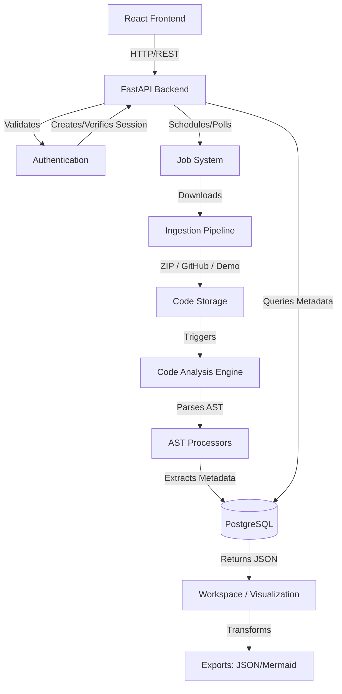

# CodeOracle Architecture

CodeOracle relies on a decoupled, asynchronous, and scalable architectural pattern, splitting frontend concerns from backend processing.

## High-Level Data Flow

## Component Overview

### Frontend (React + Vite)
- The frontend is a Single Page Application (SPA) built with React.
- **Routing & Navigation**: Handles client-side routing.
- **Job Poller State Machine**: Implements robust long-polling via `useJobPoller` to query job status without blocking the UI.
- **Visualization Components**: Uses React Three Fiber for the Neural Map and interactive DOM components for the Dependency Graph and Workspace modules.

### Backend API (FastAPI)
- Exposes a RESTful API with strict Pydantic validation schemas.
- Manages static asset delivery (serving Vite's production build) with proper caching strategies.
- Handles standard endpoints (projects, demo, analysis data).

### Authentication
- Uses secure, HTTP-only, SameSite=Lax cookies for session management.
- Supports both local Email/Password authentication (with bcrypt) and Google OAuth2 integration.
- Strictly isolates user project ownership at the database level.

### Job System & Polling Lifecycle
- Background tasks in FastAPI are utilized for asynchronous execution of heavy operations (ingestion, code analysis).
- The frontend initiates a job, receives a Job ID, and polls `GET /api/jobs/{job_id}` until the state is `completed` or `failed`.
- This ensures the UI remains responsive and connection timeouts are avoided.

### Ingestion Pipeline
- **GitHub Ingestion**: Fetches the default branch via GitHub API, downloads the archive, and extracts it to memory/disk.
- **ZIP Ingestion**: Parses user-uploaded ZIP archives, validating contents and size constraints.
- **Demo**: Loads pre-bundled benchmark repositories without downloading external dependencies.

### Code Analysis Engine
- **AST Parsing**: Python's `ast` module (and custom parsers for JS) process source code into abstract syntax trees.
- Extracts variables, functions, class definitions, complexity metrics, and import statements.
- Determines dependency structures by analyzing inter-file references.

### PostgreSQL
- The primary datastore acting as the source of truth.
- Managed via SQLAlchemy ORM.
- Stores users, sessions, jobs, projects, and the deeply nested analysis metadata.

### Workspace / Visualization
- The frontend consumes normalized JSON structures to render:
  - System Pulse (health metrics)
  - Risk Hotspots (complexity indicators)
  - Dependency Graph (node/edge graphs)
  - Neural Map (3D topology)
  - Generated Tests and Refactor Proposals

### Exports
- Users can export the entire workspace data structure as a clean JSON file.
- Specific structures like the Dependency Graph can be exported directly into Mermaid syntax for documentation embedding.
