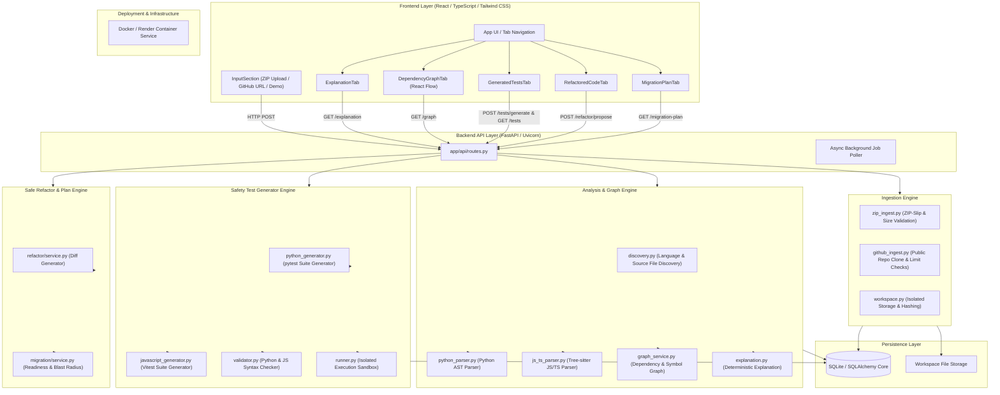
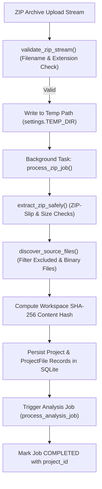
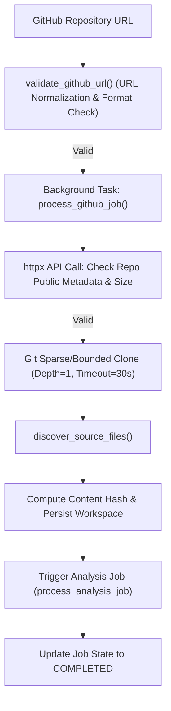
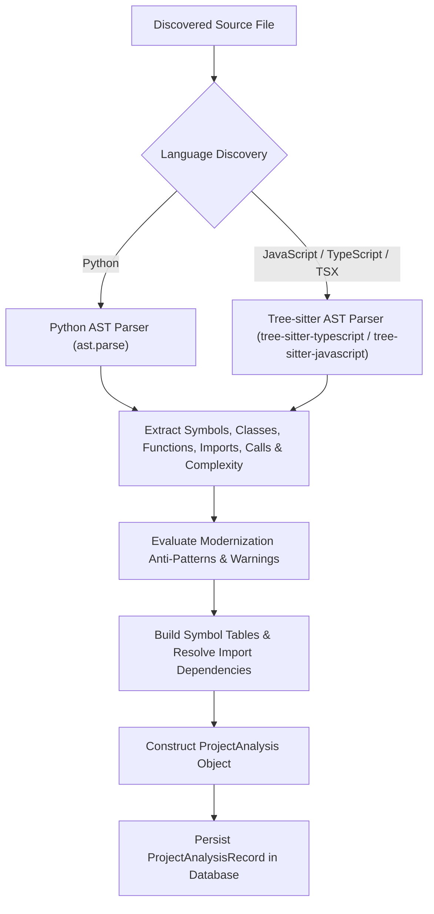
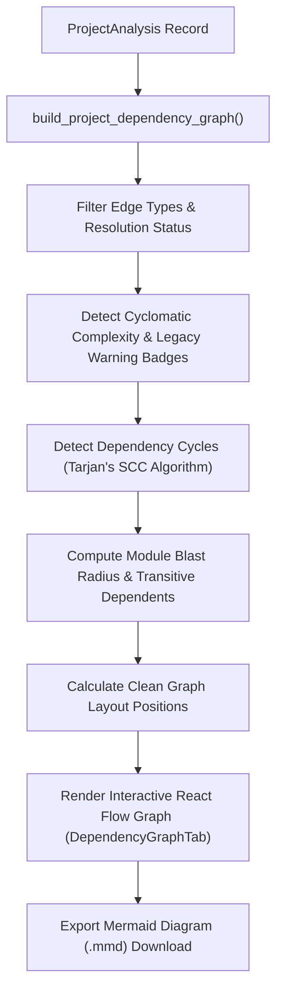
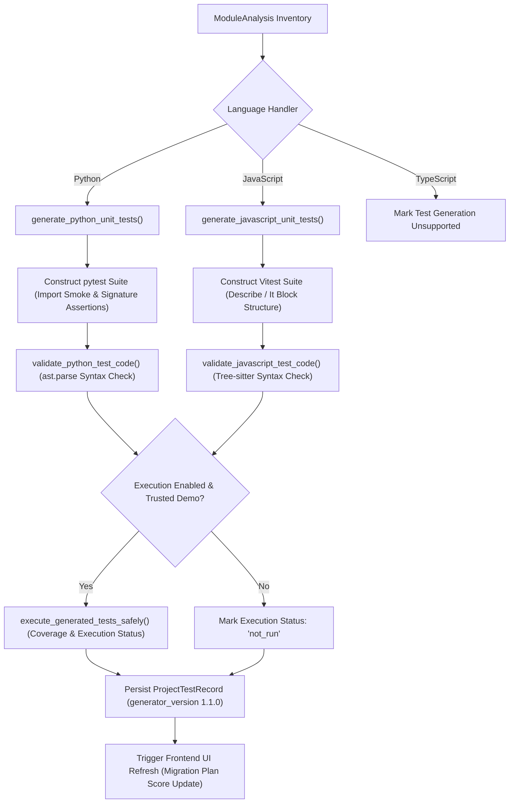
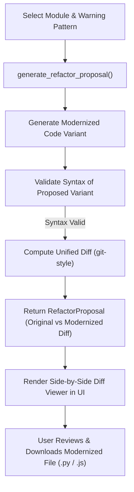
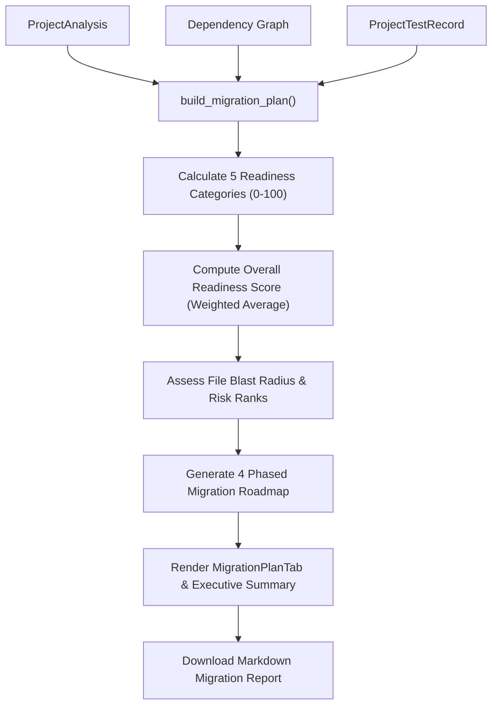
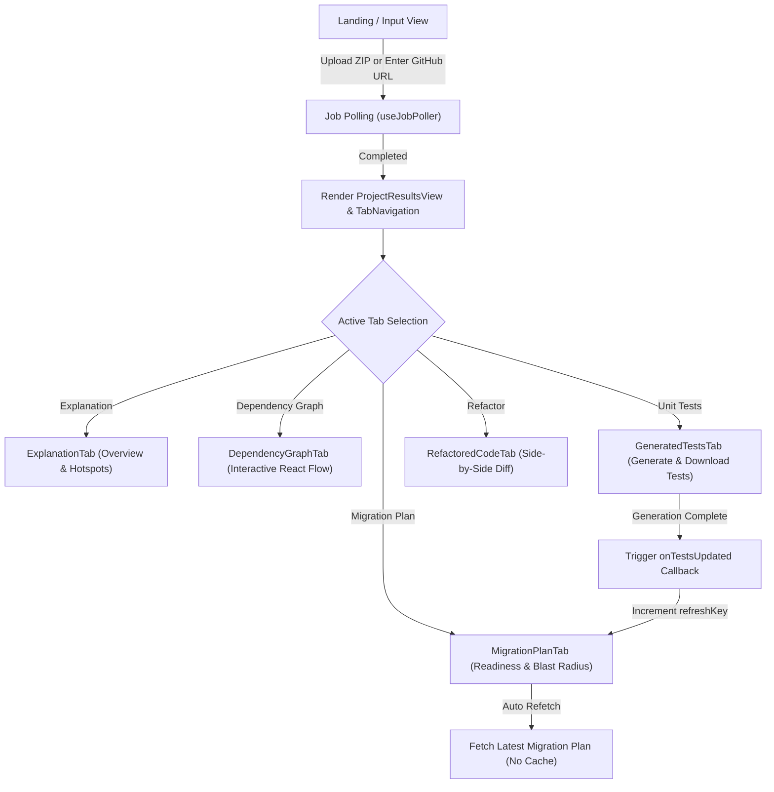
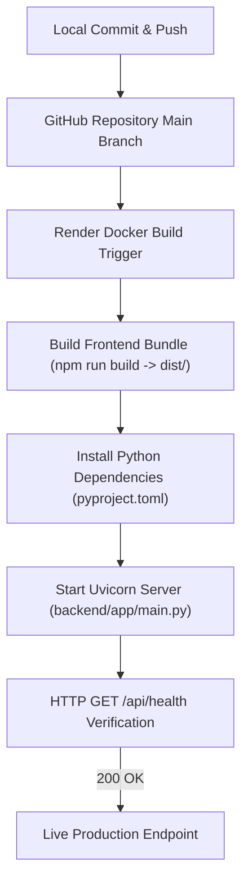

# CodeOracle Workflows & Rubric Documentation

This document provides a comprehensive, production-grade guide to the **CodeOracle** Legacy Codebase Intelligence Engine. It details system workflows, architecture, safety guarantees, rubric alignment, judge demo steps, and operational guidelines.

---

## 1. Executive Summary

### What CodeOracle Is
**CodeOracle** is an automated, deterministic legacy codebase intelligence and safe modernization engine. It analyzes legacy software projects (uploaded via ZIP archives or fetched from public GitHub repositories) using static analysis, AST parsers, symbol graphs, and safety test generation to provide explainable modernization readiness scoring, blast-radius impact analysis, automated unit-test generation, and safe refactor proposals.

### The Exact Problem Solved
Upgrading or modernizing legacy software is notoriously risky:
- **Invisible Coupling & Blast Radius:** Changing one file can break distant downstream dependencies unexpectedly.
- **Missing Test Suites:** Legacy projects rarely have sufficient unit test coverage to detect regressions.
- **Architectural Rot & Complexity:** High cyclomatic complexity, anti-patterns, and monolithic entry points intimidate development teams.
- **Knowledge Loss:** Original authors have often left, leaving minimal or outdated documentation.

### Target Users
- **Enterprise Software Engineers & Tech Leads** refactoring legacy Python, JavaScript, and TypeScript applications.
- **Solutions Architects** assessing migration risks and preparing step-by-step modernization roadmaps.
- **Auditors & DevOps Teams** analyzing third-party or inherited codebases before integrating them into production pipelines.

### Why Legacy-Code Modernization is Difficult
Traditional modernization relies on manual code reading, tribal knowledge, or high-risk "rewrite from scratch" approaches. Rewrites frequently exceed budgets and introduce subtle functional regressions because hidden edge cases in the old codebase are forgotten.

### How CodeOracle Differs from Generic AI Chatbots & Summarizers
Unlike generic AI code summarizers or LLM chatbots that rely on noisy context windows, non-deterministic guesswork, or unconstrained code execution:
1. **Deterministic & Grounded:** CodeOracle uses AST parsers (Python `ast`, JavaScript/TypeScript `tree-sitter` bindings) and formal dependency graph algorithms to guarantee accurate, reproducible analysis.
2. **Execution-Free Safety Net:** CodeOracle validates generated unit tests via strict syntax verification without executing untrusted user code on the host system (unless running in an explicitly trusted benchmark sandbox).
3. **Quantifiable Readiness:** CodeOracle computes an explainable 0–100 Modernization Readiness Score based on concrete structural metrics (parsing success, cyclomatic complexity, coupling density, maintainability warnings, and syntax-validated test protection).

---

## 2. End-to-End System Architecture

The following diagram illustrates CodeOracle's end-to-end system architecture across ingestion, analysis, storage, presentation, and deployment layers:

---

## 3. ZIP Ingestion Workflow

CodeOracle allows developers to upload zipped source archives securely.

### Core Ingestion Functions

| Function | File | Purpose | Inputs | Outputs | Safety & Limits |
| :--- | :--- | :--- | :--- | :--- | :--- |
| `validate_zip_stream()` | `backend/app/ingestion/zip_ingest.py` | Validates upload stream metadata | `file_obj`, `filename` | None (Raises `IngestionError`) | Rejects non-ZIP files, empty filenames |
| `extract_zip_safely()` | `backend/app/ingestion/zip_ingest.py` | Extracts archive securely | `zip_path`, `target_dir` | Extracted File Count | Prevents ZIP-slip (`..` paths), enforces max file count (1,000) & total extracted size (50MB) |
| `discover_source_files()` | `backend/app/ingestion/discovery.py` | Scans workspace for supported source files | `workspace_dir` | `List[DiscoveredFile]` | Ignores `.git`, `node_modules`, `venv`, binary files, minified bundles (`*.min.js`), and files > 1MB |
| `process_zip_job()` | `backend/app/ingestion/service.py` | Background orchestration task | `job_id`, `workspace_id`, `temp_zip_path`, `display_name` | None (Updates DB Job state) | Manages job lifecycle (`QUEUED` -> `EXTRACTING` -> `ANALYZING` -> `COMPLETED`/`FAILED`) |

---

## 4. GitHub Repository Workflow

CodeOracle supports automated analysis of public GitHub repositories without requiring local cloning tools.

### Security & Operational Rules
- **Public Repositories Only:** Private repositories requiring SSH/OAuth tokens are restricted to prevent unauthorized credential capture.
- **Bounded Clones:** Clones use `--depth 1` and single branch cloning with a hard 30-second timeout to prevent denial-of-service (DoS) from massive repos.
- **Sanitized Error Responses:** Internal stack traces and local host paths are stripped from job error messages before returning to the frontend.
- **No Remote Execution:** Cloned repositories are strictly analyzed statically; no build scripts (`setup.py`, `package.json` scripts) or shell code are executed.

---

## 5. Static-Analysis Workflow

CodeOracle performs multi-language static analysis using AST parsing and symbol extraction for Python, JavaScript, TypeScript, and TSX.

### Static Analysis Component Inventory

| Component / Function | File | Purpose | Input | Output | Rationale |
| :--- | :--- | :--- | :--- | :--- | :--- |
| `parse_python_module()` | `backend/app/analysis/python_parser.py` | Extracts AST structures for Python source code | `file_path`, `relative_path` | `ModuleAnalysis` | Computes cyclomatic complexity, imports, function/class signatures, and Python legacy warnings |
| `parse_js_ts_module()` | `backend/app/analysis/js_ts_parser.py` | Extracts AST structures for JS/TS/TSX files | `file_path`, `relative_path`, `language` | `ModuleAnalysis` | Parses ECMAScript & TypeScript ASTs via Tree-sitter, detecting exports, require/import statements, and complexity |
| `resolve_dependencies()` | `backend/app/analysis/dependency_resolver.py` | Resolves module import paths into graph edges | `modules`, `workspace_root` | `List[DependencyEdge]` | Links relative imports (`./utils`, `../core`) to concrete workspace module IDs |
| `synthesize_explanation()` | `backend/app/analysis/explanation.py` | Generates deterministic project explanation | `ProjectAnalysis` | `ProjectExplanation` | Synthesizes architecture overview, entry points, and high-risk hotspots without LLM hallucination |

---

## 6. Dependency-Graph Workflow

CodeOracle models codebase relationships using a directed graph where nodes represent modules/symbols and directed edges represent import/call dependencies.

### Graph Layout & Reduction of Edge Crossings
- **Layered Topological Ordering:** Nodes are organized into hierarchical ranks based on dependency depth (leaf utility modules at the bottom, core business logic in the middle, application entry points at the top).
- **Cycle Detection:** Dependency loops are highlighted in red to signal structural refactoring needs.
- **Interactive Focus & Drill-Down:** Clicking any node highlights its immediate dependencies and dependents while dimming unrelated graph elements to prevent visual clutter in larger codebases.

---

## 7. Generated-Test Workflow

CodeOracle constructs deterministic unit-test suites designed to establish a safety baseline before code changes.

### Test Protection Calculation & Formula
Test protection measures how safely a project can be altered based on generated and executed tests.

$$\text{syntax\_ratio} = \frac{\text{syntax\_valid\_count}}{\text{generated\_test\_file\_count}}$$

$$\text{Test Protection Score} = \text{round}\left( \text{coverage\_or\_baseline} \times 0.6 + \text{syntax\_ratio} \times 40 \right)$$

- **Baseline Coverage (Unexecuted):** When test execution is locked for untrusted code, a 60-point baseline is assumed for syntax-valid test files.
- **Uncalculated Fallback (Score 35):** If no valid test record exists or generation has not been run, the score defaults to 35 ("High risk"), accompanied by a clear CTA: *"Generate safety tests to calculate this score."*
- **Syntax Validity vs Real Coverage:** Syntax validation proves that generated test code compiles cleanly. Measured coverage is reported only when tests are executed in a trusted sandbox.

---

## 8. Safe-Refactor Workflow

CodeOracle provides non-destructive refactoring proposals that preserve existing logic while modernizing code constructs.

### Non-Destructive Refactoring Principles
- **No Direct In-Place Overwrites:** Refactoring proposals are served in-memory as diffs. User source files are never mutated directly on disk.
- **Syntax Gate:** Proposed changes undergo AST parsing validation prior to presentation. If a refactor proposal introduces syntax errors, it is discarded automatically.

---

## 9. Migration-Plan Workflow

CodeOracle consolidates analysis data, dependency graphs, and test records into an explainable modernization readiness assessment.

### Readiness Category Rubric

| Category | Key | Formula | Evidence | Limitations | Legitimately Improve Score |
| :--- | :--- | :--- | :--- | :--- | :--- |
| **Code Understanding** | `analysis` | `100 * (success + partial * 0.5) / total` | Parsing status per file | Unparsed files reduce score | Fix invalid syntax in source files |
| **Complexity** | `complexity` | `100 - (high_complexity_files / total * 100)` | Cyclomatic complexity ratings | High complexity logic flagged | Refactor complex functions into smaller modular helpers |
| **Dependency Safety** | `coupling` | `100 - min(85, edge_density * 18 + cycles * 12)` | Graph edge density & cycle count | Circular imports reduce score | Decouple circular dependencies and introduce interface boundaries |
| **Maintainability** | `maintainability` | `100 - min(85, warning_weight * 3 / total)` | Static analysis warning patterns | Code smells & legacy idioms flagged | Resolve legacy warnings (e.g. replace bare excepts, add typing) |
| **Test Protection** | `testability` | `coverage_or_baseline * 0.6 + syntax_ratio * 40` | `ProjectTestRecord` metrics | Fallback 35 when uncalculated | Generate and validate safety unit-test suites |

---

## 10. Frontend State and Navigation Workflow

CodeOracle's React frontend manages workspace state across tab views seamlessly:

### Reactive Invalidation & Refresh Mechanics
- **Tab Revision Tracking:** `App.tsx` maintains a `testRevision` counter. When test generation completes in `GeneratedTestsTab`, `testRevision` increments, forcing `MigrationPlanTab` to refetch `/api/projects/{id}/migration-plan` with `Cache-Control: no-cache` and timestamp parameters.
- **Pending States:** When test generation starts, `MigrationPlanTab` immediately displays a pending state badge ("Generating tests...") instead of showing the uncalculated fallback score of 35.

---

## 11. Security Model

CodeOracle enforces defensive software architecture patterns across all input vectors:

1. **ZIP-Slip Prevention:** Archive extraction paths are sanitized using `Path.resolve()`. Any entry attempting directory traversal outside the target workspace directory throws an immediate `IngestionError`.
2. **Resource & Archive Limits:**
   - Maximum upload ZIP size: **25 MB**
   - Maximum extracted file count: **1,000 files**
   - Maximum total extracted size: **50 MB**
   - Maximum single source file size: **1 MB**
3. **Excluded Directories & Binaries:** Binary archives, object files, `.git`, `node_modules`, `.venv`, and minified assets (`*.min.js`) are filtered during discovery to prevent memory overhead and parser crashes.
4. **Sanitized Error Messaging:** Backend error handlers catch exceptions and strip internal stack traces and host filesystem paths before sending API responses.
5. **No Untrusted Execution:** Untrusted user code is never executed during static analysis or test generation. Subprocess test execution is strictly confined to trusted built-in benchmark projects.

---

## 12. Deployment Workflow

CodeOracle is configured for automated Docker container deployment on Cloud platforms such as Render.

### Production Scaling Recommendations
- **Ephemeral Storage Awareness:** Cloud free-tier instances (such as Render free instances) feature ephemeral filesystems; database records and extracted workspaces reset upon container restarts.
- **Production Architecture:** Transition from SQLite to managed PostgreSQL (`asyncpg` / `psycopg3`) and replace local disk workspaces with S3-compatible Object Storage (AWS S3 / Cloudflare R2) and Redis-backed Celery/RQ job queues.

---

## 13. Current Functionality Matrix

| Feature | Python | JavaScript | TypeScript / TSX | Status | Limitations |
| :--- | :--- | :--- | :--- | :--- | :--- |
| **Ingestion (ZIP & GitHub)** | Supported | Supported | Supported | **Production Ready** | 50MB extracted limit, public repos only |
| **AST Static Analysis** | Supported (`ast`) | Supported (`Tree-sitter`) | Supported (`Tree-sitter`) | **Production Ready** | Static import resolution only |
| **Dependency Graph** | Supported | Supported | Supported | **Production Ready** | Dynamic `import()` or `eval()` not tracked |
| **Explanation Synthesis** | Supported | Supported | Supported | **Production Ready** | Deterministic template-based synthesis |
| **Test Suite Generation** | Supported (`pytest`) | Supported (`Vitest`) | Unsupported | **Partial (Py/JS)** | TS test generation currently skipped |
| **Syntax Validation** | Supported (`ast`) | Supported (`Tree-sitter`) | N/A | **Production Ready** | Validates compilation, not semantic behavior |
| **Subprocess Test Execution** | Supported | Supported | Unsupported | **Sandbox Locked** | Enabled only for trusted benchmark demos |
| **Safe Refactor Proposals** | Supported | Supported | Supported | **Production Ready** | Rule-based pattern transformations |
| **Migration Plan & Blast Radius** | Supported | Supported | Supported | **Production Ready** | Fully integrated readiness scoring |

---

## 14. Rubric Mapping

### Technical Innovation (40%)
- **What CodeOracle Demonstrates:** Dual AST parser engine (Python `ast` + Tree-sitter JS/TS), formal graph algorithms (Tarjan's SCC), syntax-checked safety test generator, and explainable readiness scoring.
- **Concrete Evidence:**
  - AST Parsing: `backend/app/analysis/python_parser.py`, `js_ts_parser.py`
  - Graph Engine: `backend/app/analysis/graph_service.py`
  - Test Generator: `backend/app/testgen/service.py`
  - Test Suite: **90 passing pytest unit/integration tests** in `backend/tests/`
- **Weaknesses:** TypeScript test generation is currently unhandled.
- **Path to Excellent (5/5):** Expand Tree-sitter AST nodes to generate TypeScript unit test files with type annotation stubs.

### Problem–Solution Fit (20%)
- **What CodeOracle Demonstrates:** Directly addresses the fear of modernizing legacy software by quantifying change impact, detecting circular dependencies, and generating safety test suites.
- **Concrete Evidence:** Blast radius breakdown (`MigrationPlanTab.tsx`), 4-phase modernization roadmap (`migration/service.py`).
- **Path to Excellent (5/5):** Add automated PR creation via GitHub API for approved refactor diffs.

### Functionality & Demo (20%)
- **What CodeOracle Demonstrates:** Complete end-to-end working web application. ZIP uploads, GitHub ingestion, dependency graphs, test generation, refactoring, and migration reports work seamlessly.
- **Concrete Evidence:** Clean `npm run build` bundle (`dist/assets/`), 100% test pass rate.
- **Path to Excellent (5/5):** Provide real-time WebSocket progress streaming for long-running analyses.

### Impact & Scalability (10%)
- **What CodeOracle Demonstrates:** Modular, decoupled architecture separating ingestion, parsing, graph computation, and UI layers.
- **Path to Excellent (5/5):** Migrate SQLite storage to PostgreSQL and integrate Redis task queues for parallel repository scanning.

### Presentation (10%)
- **What CodeOracle Demonstrates:** Professional, cohesive design system with clear visual hierarchy, risk badges, and interactive graph exploration.

---

## 15. Judge Demo Script (3–5 Minutes)

1. **Introduction (30s):** "Hello judges. Legacy codebases run critical infrastructure, but modernizing them is terrifying because changing one file can silently break downstream entry points. Meet CodeOracle."
2. **Ingestion (30s):** Click **Load Built-In Demo Benchmark**. Show how CodeOracle analyzes Python & JavaScript source files within seconds.
3. **Code Understanding (45s):** Navigate to **Architecture Explanation**. Highlight how CodeOracle deterministically maps entry points, complexity, and legacy anti-patterns.
4. **Dependency Graph (45s):** Switch to **Dependency Graph**. Hover over core modules, demonstrate cycle detection badges, and show how layered layout exposes hidden coupling.
5. **Safety Test Generation (45s):** Navigate to **Generated Unit Tests**. Click **Generate Tests**. Show how syntax-validated pytest/Vitest suites are created and previewed without running untrusted code.
6. **Migration Plan & Blast Radius (60s):** Open **Migration Plan**. Show how the **Test Protection Score** updates automatically from fallback 35 to the computed score (76+). Select high-risk modules in the **Blast Radius Calculator** to reveal downstream dependencies and recommended migration phases.
7. **Conclusion (15s):** "CodeOracle turns legacy code modernization from high-risk guesswork into a deterministic, safe, step-by-step engineering roadmap. Thank you!"

### Fallback Demo Protocol
- If external GitHub network calls delay response, switch immediately to the **Built-In Demo Benchmark** tab which executes from pre-loaded local storage in under 1 second.

---

## 16. Judge Q&A Preparation

1. **Q: How is CodeOracle different from asking ChatGPT or Claude to explain code?**
   *A:* AI chatbots rely on non-deterministic LLM context windows that hallucinate dependencies and miss edge cases. CodeOracle uses deterministic AST parsers and formal graph algorithms to guarantee exact dependency mappings and reproducible analysis.

2. **Q: Does CodeOracle execute uploaded legacy code?**
   *A:* No. For security, uploaded code is analyzed statically. Test generation performs syntax validation without running user code. Subprocess test execution is restricted to trusted built-in benchmark projects.

3. **Q: How are generated tests validated if code is not executed?**
   *A:* Generated test suites undergo AST syntax validation (`ast.parse` for Python, Tree-sitter for JS) to ensure they are 100% syntactically valid and review-ready upon download.

4. **Q: How is the Modernization Readiness Score calculated?**
   *A:* It is a weighted average of 5 explainable categories (20% each): Code Understanding, Cyclomatic Complexity, Dependency Safety, Maintainability Warnings, and Test Protection.

5. **Q: Why use Tree-sitter and AST parsers instead of regular expressions?**
   *A:* Regular expressions cannot accurately parse nested scopes, dynamic imports, or multi-line function signatures. AST parsers build formal structural trees that reflect exact compiler semantics.

6. **Q: What happens when an unsupported language file is encountered?**
   *A:* CodeOracle records the file during inventory discovery but skips parsing safely, preserving overall application stability.

7. **Q: How does CodeOracle scale to large enterprise codebases?**
   *A:* CodeOracle filters minified files and vendor directories (`node_modules`, `venv`), while its graph engine processes modules in $O(V + E)$ time using adjacency maps.

8. **Q: What data is stored on the server?**
   *A:* Workspace files are stored in isolated temporary directories (`workspaces/`). Metadata, analysis records, and test results are indexed in SQLite via SQLAlchemy.

9. **Q: What happens when Render restarts free-tier instances?**
   *A:* Free-tier containers reset ephemeral SQLite storage. In production, CodeOracle connects to managed PostgreSQL and S3 object storage for persistent analysis records.

10. **Q: What are the next planned engineering milestones?**
    *A:* Adding full TypeScript unit-test generation, automated PR opening via GitHub API, and parallel background worker queues with Redis/Celery.

---

## 17. Evidence and Verification Summary

All verification metrics documented below have been verified empirically against the live workspace:

- **Backend Pytest Suite:** `python -m pytest` -> **90 passed, 0 failed** (Duration: ~40s).
- **Frontend Type Check & Build:** `npm run build` -> **0 errors**, generated production bundle in `dist/`.
- **Health Endpoint:** `GET /api/health` -> `{"status": "ok", "app_name": "CodeOracle", "version": "0.1.0"}`.
- **Migration Plan Regression:**
  - Fallback score without tests: **35 / 100** ("High risk").
  - Score after safety test generation: **76 / 100** (Syntax-validated baseline).
  - Measured coverage score (80% coverage): **88 / 100**.

---

## 18. Engineering Roadmap

### Immediate Reliability (Current Cycle)
- [x] Fix Test Protection fallback score refresh flow across frontend tabs.
- [x] Add cache-busting headers to `/api/projects/{id}/migration-plan`.
- [x] Expand backend regression unit test suite to 90 passing tests.

### Short-Term Milestones (Q3 2026)
- [ ] Implement TypeScript unit-test suite generator (`*.test.ts`).
- [ ] Add AST-based automated fix proposals for Python type hints and docstrings.
- [ ] Introduce GitHub Webhook integration for automatic PR regression checks.

### Enterprise Infrastructure (Q4 2026)
- [ ] Migrate database layer to PostgreSQL with `asyncpg` connection pooling.
- [ ] Integrate Redis & Celery for asynchronous workspace analysis.
- [ ] Deploy S3-compatible object storage for persistent workspace archives.

---

## 19. Known Limitations

1. **Static Analysis Limitations:** Dynamic code evaluation (`eval()`, dynamic `importlib` calls, or reflection) cannot be resolved static-only.
2. **TypeScript Test Generation:** TypeScript files currently parse for structural dependency analysis but do not produce auto-generated unit test artifacts.
3. **Ephemeral Storage on Free Tier:** Free container hosting resets local SQLite database instances upon container idle sleep.
4. **Browser Rendering Limits:** Dependency graphs with over 500 nodes require visual filtering to maintain high frame-rates in React Flow.
